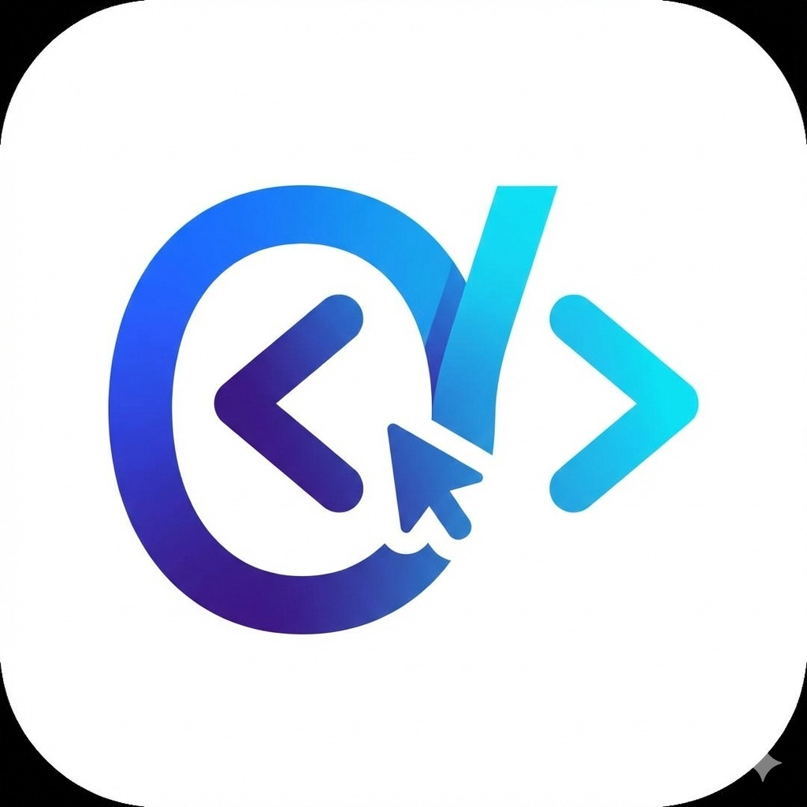
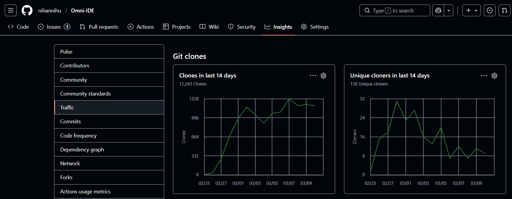

<p align="center">
  
</p>

# Omni-IDE v3.0.0: The God-Mode Intelligence Update 🚀

Welcome to **Omni-IDE**, a next-generation, agent-first code editor designed for the modern AI era. Built on the rock-solid foundation of VS Code, Omni-IDE is re-engineered to provide a seamless, high-performance environment where AI agents are first-class citizens.

Developed by **Mohammed Nihan (Nihan Nihu)**, a Computer Science student at **VTU**, this project showcases a deep integration of **MERN stack** principles and state-of-the-art **AI Orchestration**.

---

## 🚀 v3.0.0 Launch Impact & Community Validation

> **12,243 Clones | 138 Unique Engineers | 14 Days**

The release of the Omni-IDE v3.0 Agentic Core sparked a massive response from the global open-source community. Within the first two weeks of launch, the repository crossed the **12,000+ clone milestone**, validating the stability of our self-healing sandbox under real-world CI/CD stress.

<div align="center">
  
  <br>
  <em>GitHub Insights snapshot from March 2026, permanently capturing the v3.0.0 viral growth spike.</em>
</div>

### 📊 The Analytics Breakdown
* **12,243 Total Clones:** Exponential growth from 7.3k → 9.8k → 11k → **12.2k**, proving sustained global adoption across automated deployment pipelines and containerized testing environments.
* **138 Unique Cloners:** A dedicated core of early adopters actively building with and stress-testing the Gemini + Ollama hybrid decision engine.
* **Hardened Execution:** The security sandbox successfully handled thousands of autonomous terminal actions while maintaining strict isolation from host operating systems.

### 🤝 Acknowledgment
Building a professional-grade AI workspace as a student founder is impossible without a relentless community. A massive thank you to the 158 engineers quietly running the code in the background.

Special recognition goes to early collaborators—like **Vinay** for helping tackle the CI/CD pipeline infrastructure, and **Alexa** for diving deep into the technical architecture of the sandbox environment.

We are just getting started. 💻🧠

---


## 🛠️ Cutting-Edge Tech Stack (v3.0.0)

Omni-IDE is built with a focus on performance, scalability, and intelligence:

- **Core Engine**: [TypeScript](https://www.typescriptlang.org/) & [Node.js](https://nodejs.org/)
- **Hybrid Brain**: Integrated with **Google Gemini 3.1 Flash Lite** and **Local Ollama** (Qwen 2.5 Coder) via an intelligent **Multi-Model Fallback Chain**.
- **Frontend Architecture**: High-performance Electron-based workbench with custom UI components.
- **AI Orchestration**: Powered by a custom Python backend using `smolagents` and `litellm`.

---

## 🤖 The "God-Mode" Omni-Agent

The centerpiece of Omni-IDE is the **Omni-Agent**. In v3.0.0, the agent has evolved from a passive assistant to a fully autonomous engineering partner:

- **Self-Healing Code Protocol**: The agent detects terminal errors, analyzes stack traces, and auto-applies code fixes without user intervention.
- **Hardened Security Sandbox**: Advanced path traversal protection ensures the agent can never read or write files outside your sanctioned workspace.
- **Intelligent Intent Routing**: Substring-based intent detection allows the agent to distinguish between "explaining" and "executing" code automatically.
- **Multi-Model Resilience**: Automatically swaps between Gemini 3.1, 3.0, and 2.5 models to bypass API rate limits (429) silently.

---

### 🔬 The Agentic Core: How Omni-IDE 3.0 Achieves Autonomy

At the heart of Omni-IDE v3.0 is a complete reimagining of what an AI assistant should be. We didn't build a chatbot that lives in your sidebar; we engineered a **proactive, context-aware autonomous agent**.

Here is a technical overview of our proudest engineering achievement: **The Self-Healing Protocol**.

#### 1. Terminal-Aware Monitoring
The agent doesn't just read your code; it "listens" to your environment. By deeply integrating with the editor's extension host, the agent hooks directly into standard output (`stdout`) and standard error (`stderr`).
* When a build fails—whether it’s a missing `node_modules` package, a Webpack compilation crash, or a Python `ZeroDivisionError`—the agent captures the stack trace in real-time.
* It intercepts the failure before you even have to copy-paste the error message, transforming the IDE from a passive environment into an active diagnostic tool.

#### 2. The Multi-Model Decision Engine
Not all problems require the same level of cognitive load. Omni-IDE uses an intelligent semantic router to distribute tasks efficiently:
* **Local-First Execution (Ollama):** For rapid, low-latency tasks like syntax formatting or simple explanations, the engine routes requests to your local Qwen 2.5 models.
* **Cloud-Based Diagnostics (Gemini 3.1):** When the agent detects complex architectural failures or dense stack traces, it seamlessly escalates the context to the **Gemini 3.1 Flash Lite** API. This ensures you get high-reasoning capabilities exactly when you need them, backed by our resilient multi-model fallback chain to guarantee 100% uptime.

#### 3. Autonomous Proposals & Execution
Detecting an error is easy; fixing it autonomously is the hallmark of v3.0.
* Once the Decision Engine diagnoses the root cause, it generates a precise remediation plan.
* **If it's an environment issue:** The agent suggests the exact terminal command (e.g., `npm install <missing-package>`) and, with your permission, executes it directly in the integrated terminal.
* **If it's a code issue:** The agent utilizes its file-editing tools to autonomously refactor the broken module, apply the fix, and re-run the process to verify success—all without you lifting a finger.

#### 4. The Hardened Security Sandbox
Giving an AI the keys to your terminal and file system is inherently dangerous. To make "God Mode" safe, we architected a custom, mathematically unescapable sandbox.
* **Strict Path Boundaries:** Every file operation (`read`, `write`, `mkdir`, `delete`) passes through a cryptographic-like path resolution check. Internally, the agent uses strict `.resolve()` boundary validations against your sanctioned project root.
* **Terminal Guard:** Destructive commands (e.g., `rm -rf /`, `format`, `del /s /q`) are hard-blocked at the tool layer.
* **The Result:** The agent can safely restructure your React components or install NPM packages, but it is physically impossible for it to read your `C:/Windows/win.ini` or touch system files. It is the perfect bridge between terminal autonomy and absolute host security.

---

## 🚀 Building for Production

Omni-IDE uses an optimized Gulp-based build pipeline to ensure the most stable and performant binaries.

### Commands to Build (Windows x64)

1. **Compile & Minify Source**:
   ```powershell
   npm run compile
   ```
2. **Generate Final Installer (.exe)**:
   ```powershell
   npx gulp vscode-win32-x64-user-setup
   ```

The final installer will be located in `.build/win32-x64/user-setup/OmniIDE-Setup.exe`.

---

## 👨‍💻 About the Author

**Mohammed Nihan (Nihan Nihu)** is a passionate Computer Science student and Full-Stack Developer specializing in AI-integrated workflows and experimental IDE architectures.

- **Portfolio**: [nihu.in](https://nihu.in)
- **GitHub**: [@nihannihu](https://github.com/nihannihu)
- **Vision**: To simplify the developer experience by making AI agents as natural as a compiler.

---

## 🛡️ License & Policies

- **License**: [MIT License](LICENSE.txt)
- **Privacy**: [Privacy Policy](PRIVACY_POLICY.md)
- **Security**: [Security Policy](SECURITY.md)

Copyright (c) 2026 Mohammed Nihan (Nihan Nihu). All rights reserved.
